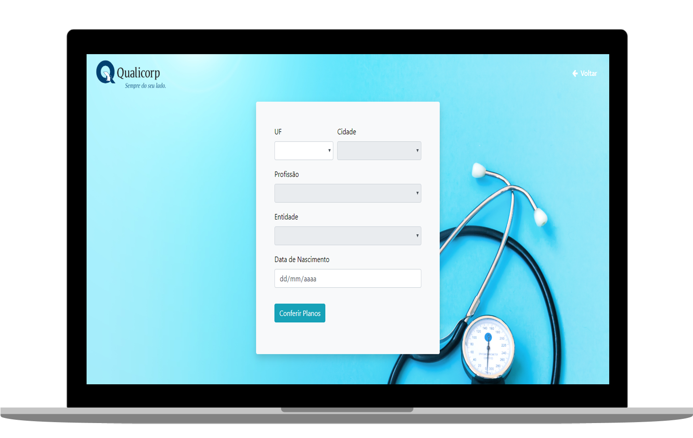

<h1 align="center">
  QUALICORP
</h1>

   
   

  
  
  

  

## ◾ Teste

Este teste teve o intuito de demonstrar conhecimentos no consumo de API REST utilizando o framework Vue.js. O objetivo era listar planos de saúde com base nos dados do formulário. Todos os campos do formulário são alimentos por dados de API, apenas o campo data de nascimento está aberto para o usuário.

Obs: Este teste foi feito em 1h e 40m e a estilização não foi o foco.

#### Faça um teste: [Qualicorp-teste.com](https://teste-qualicorp.000webhostapp.com/)

## ◾ Tecnologias

Esse teste foi desenvolvido com as seguintes tecnologias:

- [HTML](https://developer.mozilla.org/pt-BR/docs/Web/HTML)
- [CSS](https://developer.mozilla.org/pt-BR/docs/Web/CSS)
- [JAVASCRIPT](https://developer.mozilla.org/pt-BR/docs/Web/JavaScript)
- [VUEJS](https://br.vuejs.org/index.html)

## ◾ Licença

Esse projeto está sob a licença MIT
